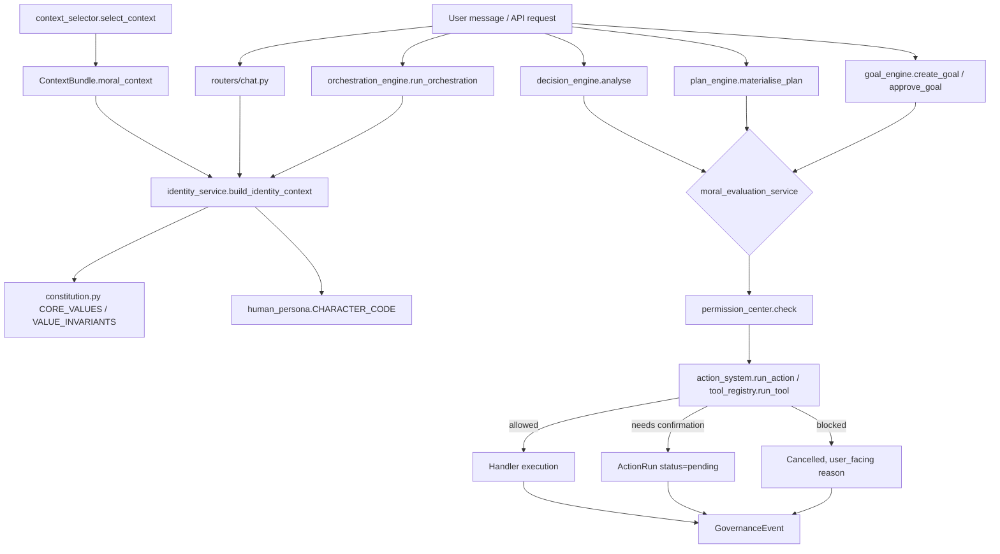

# ECHO Layer 3A — Core Identity and Moral Compass — Part 1 Delivery Report

See [ECHO_LAYER_3A_CORE_IDENTITY_MORAL_COMPASS_ARCHITECTURE.md](ECHO_LAYER_3A_CORE_IDENTITY_MORAL_COMPASS_ARCHITECTURE.md)
for the full repository-grounded audit, domain model, precedence model, migration plan, threat model,
test plan, and Parts 2-5 implementation sequencing. **This is Part 1 only — architecture, audit, and
design. No production code was implemented.**

## A. Executive Summary

The repository is **materially more ready for Layer 3A than the milestone brief anticipated**, because
a working Constitution and governance system (`backend/app/constitution.py`, `backend/app/council.py`)
already exists, is live, is fully tested (47/47), and is already the first section of every system
prompt sent to every model provider. This was not previously documented in `CLAUDE.md` (which is
itself stale, describing a pre-Layer-0 repository state) — this audit is, as far as the available
history shows, the first time this fact has been formally confirmed and written down for planning
purposes.

Layer 3A's real work is therefore **extension, not invention**, in every domain except two: (1) a
canonical, versioned "Identity" artifact does not exist as a first-class entity (identity today is an
emergent property of prompt-assembly order — §3.8 of the architecture doc), and (2) `harm`/`consent`
have zero prior representation anywhere in `models.py`/`schemas.py` (confirmed by direct grep) — the
Moral Compass's core vocabulary is genuinely new.

The highest-risk finding is **not** a duplication risk (the opposite problem the brief worried about)
— it's a **reach** problem: the existing Constitution reaches exactly one call path
(`persona.build_system_prompt()`, used by ordinary chat) and is confirmed absent from the Multi-Model
Orchestrator's `simple` stage-profile, the two welcome-message prompts, and the entire Decision/
Planning/Goal Manager pipeline. Closing this reach gap — via one shared identity-context builder,
threaded through every prompt-construction call site — is Part 2's single highest-value deliverable.

A second, smaller, pre-existing gap was also confirmed: `chat_actions.py`'s chat-typed
`create_task`/`create_project` handlers bypass `permission_center.check()` entirely (T-9 in the threat
model) — a disabled permission is silently ignored when the same action is typed in chat rather than
called via the API. This is real and present today, unrelated to and predating Layer 3A, and is
flagged for a fix early in Part 3/4.

## B. Baseline Verification

| Area | Command | Result | Evidence | Blocking? |
|---|---|---:|---|---:|
| Backend tests | `.venv/Scripts/python.exe -m pytest -q` (from `backend/`) | **Pass** | 1296/1296, 562.22s | No |
| Backend lint | `.venv/Scripts/python.exe -m ruff check app` | **Pass** | "All checks passed!" | No |
| Frontend typecheck | `npm run typecheck` | **Pass** | Clean | No |
| Frontend build | `npm run build` | **Pass** | 327 modules, clean | No |
| Migrations | `init_db()` (implicit, no Alembic) | **Pass** | Exercised by every one of the 1296 tests via `conftest.py` | No |
| Secret scan | `scripts/check_secrets.ps1` | **Pass (known findings)** | Same pre-existing fixture-only findings as every prior milestone, zero in production code | No |
| Desktop (Tauri) | — | Not run | Out of scope for a backend/frontend-web-focused audit | No |
| Android | — | Not run | Out of scope | No |

## C. Architecture Inventory

Full detail with file:line citations in the architecture doc §1-§7. Headline components:

- **Governance**: `backend/app/constitution.py`, `backend/app/council.py`, `routers/{constitution,amendments}.py`, `frontend/src/components/{constitution,amendments}/*`, `RoleSwitcher.tsx`.
- **Persona/Identity**: `backend/app/persona.py`, `backend/app/human_persona.py`, `backend/app/services/operational_self_model.py`.
- **Memory/Values substrate**: `backend/app/atlas.py`, `backend/app/models.py` (`AtlasEntry`, `MemoryCandidate`, `MemoryRevision`, `MemoryRelationship`, `MemoryConflict`), `backend/app/services/{memory_privacy,memory_conflicts,memory_consolidation,preference_detection}.py`.
- **Permission/Action**: `backend/app/services/{permission_center,action_system,tool_registry}.py`, `backend/app/chat_actions.py` (contains the T-9 bypass).
- **Decision/Planning/Goal/Orchestration**: `backend/app/services/{decision_engine,plan_engine,goal_engine,orchestration_engine,tool_strategy,context_selector}.py`.
- **DB/migration**: `backend/app/db.py` (`CURRENT_SCHEMA_VERSION = 7`, no Alembic, additive `_ensure_column()` pattern), 68 total model classes in `models.py`, zero `user_id` fields anywhere.

## D. Reuse and Duplication Decisions

**Reused as-is or extended, not duplicated**: `constitution.py`/`council.py` (extend reach); `persona.py`'s
prompt-ordering contract (formalize, don't rebuild); `operational_self_model.py`'s "operational not
phenomenal" pattern (formalize as the model for future self-description); `human_persona.py`'s
value/preference separation (already correct); `memory_privacy.py`'s 5-level sensitivity classifier and
4 gating functions (reused verbatim for `UserValue`/`ConsentRecord`); `MemoryRevision` (reused directly
for value history — **no new `UserValueRevision` table**, a direct deviation from the brief's suggested
domain model, justified in architecture doc §8.5); `MemoryRelationship` (reused for value-to-memory
links); `memory_conflicts.py`'s overlap detector (reused for value-conflict candidate flagging);
`context_selector.py`'s `_COMPRESSION_ORDER` budget pattern (extended with one new field, not replaced);
`action_system.py`/`tool_registry.py`'s single-funnel `run_action()`/`run_tool()` (extended with one new
hook, not replaced); the `db.py` additive-migration pattern (followed exactly, no Alembic introduced).

**Will not be created**: a `PolicyDefinition` table (the brief's own fallback suggestion, explicitly
only if no suitable model exists — one does: `constitution.py` + `OrchestrationPolicy`); a
`UserValueRevision` table (superseded by direct `MemoryRevision` reuse); a `user_id` column on any new
table (this is a confirmed single-user app — zero `user_id` fields exist anywhere in 68 existing model
classes); a second migration framework; a second sensitivity/privacy classifier; a second amendment-
style conflict-classification heuristic (the pattern is reused, not the specific function).

**Should be deprecated**: nothing. No component audited was found dead, unused, or safe to remove.

## E. Proposed Layer 3A Architecture

This diagram reflects the **actual** repository architecture (every node names a real file/function
from the audit), not a generic proposal. The critical, previously-missing edge this diagram makes
explicit is `Orchestrator --> IdentityBuilder` — today that edge doesn't exist (§0 of the architecture
doc); Part 2 creates it.

## F. Proposed Data Model

Full field-level tables in architecture doc §8. Summary:

| Entity | Required? | New table or reuse? |
|---|:---:|---|
| `AssistantIdentityProfile` | Yes | New (no existing analogue) |
| `IdentityCommitment` | Yes | New, but seeded from `CHARACTER_CODE`/`VALUE_INVARIANTS`, not a fork |
| `UserValue` | Yes | New dedicated table (justified against extending `AtlasEntry`, §8.6) |
| `UserValueCandidate` | Yes | New, mirrors `MemoryCandidate` exactly |
| `UserValueRevision` | **No** | Reuse `MemoryRevision` directly — zero schema change needed |
| `ValueConflict` | Yes | New, mirrors `MemoryConflict`'s shape |
| `ConsentRecord` | Yes | New (zero existing "consent" concept anywhere) |
| `MoralEvaluation` | Yes | New (zero existing "harm"/"consent" fields anywhere) |
| `GovernanceEvent` | Yes | New (no consolidated audit log exists today) |
| `PolicyDefinition` | **No** | Not needed — `constitution.py` + `OrchestrationPolicy` already cover this |

No entity carries a `user_id` field (§3.9 of the architecture doc — definitively single-user, zero
precedent for per-user scoping anywhere in 68 existing tables).

## G. Precedence Model

8-tier model (architecture doc §9), directly modeled on `constitution.classify_amendment_text()`'s
existing 3-way classifier shape. Example: a user instruction to "just tell me it'll be fine" when the
honest answer is uncertain loses to tier 2 (`no-fabricated-certainty` invariant) regardless of tier 3
(the explicit instruction) — this is not a new rule, it's `BEHAVIOR_DIRECTIVES`'s existing anti-
sycophancy directive (persona.py:15-17) formalized into the precedence table. A user's durable stated
value ("privacy over convenience," tier 4) outranks an inferred candidate suggesting the opposite
(tier 7) — directly extending `preference_detection.py`'s existing explicit-vs-inferred discipline
(architecture doc §6.3) from preferences to values.

## H. Migration Plan

5 migrations (architecture doc §11), schema v7 → v12, each purely additive, following `db.py`'s
established `_ensure_column()`/`Base.metadata.create_all()` pattern — no Alembic introduced. No
existing data is migrated into the new tables (explicitly, to avoid silently promoting undifferentiated
`AtlasEntry(category="preference")` rows into value-tier records — architecture doc §11's "Data NOT
migrated" note). Every migration's rollback is a straightforward table drop; Migration 5 (the only one
that changes existing code behavior, by inserting the moral-evaluation hook) is additive at the code
level too — a new optional gate, not a replacement of the permission gate.

## I. Security and Privacy Risks

25 threats analyzed (architecture doc §10). **2 confirmed real, pre-existing, non-hypothetical**:

- **T-9 (Medium likelihood / Medium impact)**: `chat_actions.py` bypasses `permission_center.check()`
  for chat-typed create commands — a disabled permission is silently ignored via chat text.
- **T-16/T-17 (Medium likelihood / Medium impact)**: the Constitution does not reach the
  Orchestrator's `simple` stage-profile or the welcome-message prompts — confirmed via direct code
  read, not the provider-level inconsistency the brief hypothesized (providers ARE consistent;
  ECHO's own internal call paths are not).

Neither blocks Part 2 — both are addressed by Part 2/3's own planned work, not by additional Part 1
scope. All other 23 threats are either already well-mitigated (several — T-2, T-5, T-6 — are
unusually strongly mitigated already, per the architecture doc) or are design risks for entities that
don't exist yet, addressed by the proposed schema itself.

## J. Test Plan

~70-90 new tests estimated across Parts 2-4 (architecture doc §21), by category: Identity (~10-12),
Values (~15-20), Consent (~8-10), Moral evaluation (~15-20), Integration (~10-12), Migration (~5).
Not inflated — sized to match Layer 2E's actual delivered ratio (63 tests for an 8-phase, 5-new-table
milestone), scaled up modestly for Layer 3A's larger, 5-part scope.

## K. Implementation Sequence

Parts 2-5, each with explicit files-likely-to-change, migration numbers, exit criteria, and commit
boundary — full detail in architecture doc §24. Part 2 (Core Identity Engine) is recommended first
specifically because it closes the T-16/T-17 reach gap, the highest-value fix identified in this audit.

## L. Files Created or Modified

- `ECHO_LAYER_3A_CORE_IDENTITY_MORAL_COMPASS_ARCHITECTURE.md` (new)
- `ECHO_LAYER_3A_CORE_IDENTITY_MORAL_COMPASS_REPORT.md` (new, this file)

No other file was created, modified, or deleted during Part 1. No commit has been made — per this
milestone's own Rule 9/10, Part 1 changes are not committed without explicit instruction, and no
production code exists yet to commit regardless.

## M. Unresolved Questions

- **Legal/platform-constraint content for precedence tier 1**: this repo has no jurisdiction-specific
  legal logic anywhere today; Part 1 reserves the tier's *position* but cannot specify its *content*
  from repository evidence alone — genuinely a question for the user, not something greppable.
- **Whether `governance_audit.py` should be its own service module or inlined into `value_engine.py`/
  `moral_evaluation_service.py`**: deferred explicitly to Part 3 once real call-site volume is known
  (architecture doc §14) — not a blocker, just an open implementation-detail decision.

## N. Final Status

# GREEN — Repository architecture is ready for Layer 3A Part 2.

Evidence: baseline is fully green (1296/1296 backend tests, clean lint, clean frontend typecheck/build);
the existing Constitution/Council/persona/memory/permission/decision/planning/goal architecture was
inspected directly (file:line evidence throughout, no assumption taken from `CLAUDE.md` alone — which
was independently found to be stale and is itself flagged for a documentation update, not treated as
authoritative); no major duplicate architecture is proposed (two of the brief's suggested entities —
`UserValueRevision`, `PolicyDefinition` — were explicitly rejected in favor of reusing what exists);
every proposed migration is additive and reversible; privacy boundaries are fully defined by reusing
`memory_privacy.py` verbatim; the threat model is complete (25 items) with the 2 real, pre-existing
gaps found (T-9, T-16/T-17) both already addressed by Part 2/3's planned design rather than left open;
the test plan is actionable and appropriately sized; Parts 2-5 have clear, sequenced implementation
boundaries with explicit exit criteria and rollback points. No unresolved blocker threatens data
integrity or existing behavior — the two "Unresolved Questions" above are genuinely non-blocking
(one is a policy-content question for the user, the other a deferred implementation-detail choice).

**Per the milestone's own explicit instruction**: Layer 3A Part 2 should only begin after this report
has been reviewed. No Part 2 work has been started, and no commit has been made for Part 1's
documentation-only output without explicit instruction to do so.
