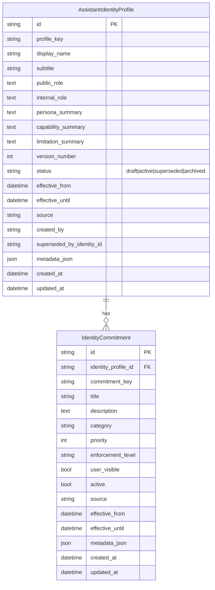
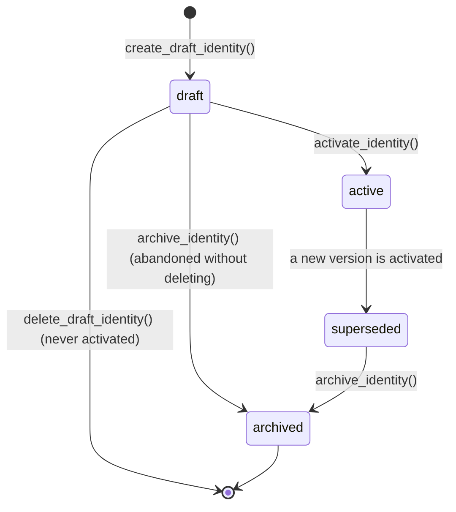

# ECHO Layer 3A Part 2A — Core Identity Data Models and Database Foundation

The first production implementation milestone of Layer 3A. Builds a reliable, versioned,
local-first source of truth for ECHO's operational identity and behavioral commitments. See
[ECHO_LAYER_3A_CORE_IDENTITY_MORAL_COMPASS_ARCHITECTURE.md](ECHO_LAYER_3A_CORE_IDENTITY_MORAL_COMPASS_ARCHITECTURE.md)
for the Part 1 audit this milestone follows, and
[ECHO_LAYER_3A_PART2A_CORE_IDENTITY_REPORT.md](ECHO_LAYER_3A_PART2A_CORE_IDENTITY_REPORT.md) for the
delivery report.

## 1. Overview

**Purpose**: give ECHO one versioned, queryable, database-backed record of what it currently is —
its display identity, its role, its persona summary, its honest limitations, and a structured list
of behavioral commitments — so later Layer 3A parts (the runtime Identity Engine, the Moral Compass,
the Value/Consent Engine) have a stable foundation to build on instead of re-deriving identity from
scattered prompt text each time.

**What identity is**: a small set of stable facts about ECHO itself, versioned like any other
durable record in this codebase (see `Goal`/`Plan`/`DecisionCase`'s own status-transition
convention). An identity version is created once and never edited in place — a meaningful change
always produces a new version, and old versions are retained as `superseded` or `archived` history,
never deleted (except a draft that was never activated).

**What identity is not**: a user's moral values, a user's granted permissions, a live chat
system prompt, a place to store reasoning traces, or a place to store any user-specific content at
all. See the Safety Note (§5) for the hard boundaries this milestone enforces.

**Relationship to persona**: `backend/app/human_persona.py`'s `CHARACTER_CODE` and
`PersonaSettings` remain exactly what they were — style/communication configuration, per-`tester_id`,
never capable of touching truthfulness or safety. Core Identity does not replace or wrap them; it
sits alongside them as a distinct, install-wide concept. Persona answers "how does ECHO talk";
Identity answers "what is ECHO."

**Relationship to user memory**: `backend/app/atlas.py`'s `AtlasEntry`/`MemoryCandidate` remain
exactly what they were. Nothing in this milestone reads from or writes to Atlas, and no
identity table has a `user_id` or `tester_id` column — this is a confirmed single-user app (Part 1
architecture doc section 3.9) and identity is install-wide, not per-conversation or per-tester.

**Relationship to moral evaluation**: none yet. This milestone builds data only — no
`IdentityService` runtime orchestration, no prompt injection, no evaluation logic. That is
explicitly Part 2B's (runtime/prompt integration) and later Parts' (moral evaluation) job.

**Relationship to the Constitution**: invariant-backed commitments reuse exact
`constitution.VALUE_INVARIANTS` IDs and name `constitution.py` as their enforcement source; these
rows are descriptive, not a second policy engine. Part 1 proposed a `constitution_version` snapshot
column, but the more specific Part 2A field contract omitted it, so this foundation does not invent
one. Runtime assembly of the current Constitution remains Part 2B scope; source/creator/metadata and
the referenced invariant key provide Part 2A provenance without silently syncing or mutating old
identity versions.

## 2. Data model



**Constraints**: `UniqueConstraint(profile_key, version_number)` on `AssistantIdentityProfile`;
`UniqueConstraint(identity_profile_id, commitment_key)` on `IdentityCommitment`; real foreign keys
for both commitments and `superseded_by_identity_id`; and named `CHECK` constraints for positive
versions, non-empty keys/names, valid statuses/sources/categories/enforcement levels/priorities, and
valid effective-date ranges. SQLite `PRAGMA foreign_keys=ON` is already enabled process-wide by
`db.py`'s existing `_enable_sqlite_foreign_keys` listener.

**Indexes**: `profile_key`, `status`, and a composite `(profile_key, status)` "active lookup" index
on `AssistantIdentityProfile`; `identity_profile_id`, `category`, `enforcement_level`, `active` on
`IdentityCommitment`; plus SQLite partial unique index `uq_identity_profiles_one_active` on
`profile_key WHERE status='active'`. The partial index is the database-level final backstop for the
single-active-version invariant.

**No `user_id`, no `tester_id`**: per Part 1's definitive single-user-app finding, neither table
carries any per-user or per-tester scoping column.

**Selection rule**: profile keys are trimmed and lowercased at repository boundaries. The public
active lookup requires the normalized key, `status="active"`, `effective_from <= now`, and no
expired `effective_until`; the highest valid version wins as a defensive ordering rule. Lifecycle
activation separately finds even an expired status-active row so it can supersede it cleanly before
the partial unique index admits a replacement.

## 3. Lifecycle, versioning, activation, archive, deletion



- **Versioning**: `version_number` is always the next unused integer for a given `profile_key`
  (computed via `MAX(version_number) + 1`), regardless of the status of prior versions. A meaningful
  identity change is never an in-place `UPDATE` — `create_draft_identity()`/
  `create_new_identity_version()` always insert a new row.
- **Activation** (`activate_identity()`) is atomic within one DB transaction: the target must be
  `status="draft"`; whatever was previously active for the same `profile_key` is set to
  `status="superseded"` with `superseded_by_identity_id` pointing at the new version; the target is
  set to `status="active"` with `effective_from=now()`, and the old row receives
  `effective_until=now()`. The old row is flushed first, then the new row, so the partial unique
  index never sees a transient duplicate. The function verifies `count_active_identities()==1`
  before commit; uniqueness/locking failures roll back and become `IdentityActivationConflictError`.
- **Archive** (`archive_identity()`): allowed only from `draft` (abandoning an unused draft without
  hard-deleting it) or `superseded` (retiring old history from casual display while keeping it
  queryable). An `active` identity cannot be archived directly — a replacement must be activated
  first, mirroring the "never leave zero active profiles by surprise" discipline of
  `activate_identity()` itself.
- **Deletion** (`delete_draft_identity()`): hard delete, restricted to `status="draft"` rows that
  were never activated. Any other status raises `ProtectedIdentityDeletionError`. The repository
  explicitly deletes that draft's owned commitments before deleting the draft. There is deliberately
  no relationship-wide delete cascade, so deleting an active/superseded identity cannot silently
  cascade-delete its historical commitments.

## 4. Concurrency

This is a single-process, file-based SQLite application (confirmed in Part 1's audit — no
multi-worker deployment exists). The guarantee has three layers: an ordered transactional
supersede-then-activate sequence; a pre-commit count check; and the partial unique active-profile
index. SQLite may serialize two competing calls (both succeed in sequence) or reject one due to a
unique/locking conflict; a rejection is rolled back and translated to
`IdentityActivationConflictError`. A real two-session/thread test races two drafts against the same
temporary SQLite file and proves exactly one active row remains. Separate tests force a database
collision and verify typed rollback, and prove a missing/invalid target never loses the old active
identity.

## 5. Safety note

- **No false consciousness claims**: `identity_service._check_no_consciousness_claim()` is a
  deterministic set of explicit subject-plus-positive-predicate patterns (never an LLM call),
  applied to every free-text identity and commitment field at write time. It rejects clear claims
  such as "I am conscious," "No doubt, I am conscious," "ECHO is sentient," "I possess a soul," and
  "I can suffer." Honest denials such as "ECHO is not conscious" pass, as does non-self-claiming
  technical discussion such as "ECHO can explain consciousness as a concept." It remains a
  documented, deliberately narrow pattern matcher rather than a general NLP classifier.
- **No user moral values in global identity**: nothing in this milestone represents a user's
  politics, religion, health information, personal morality, private relationships, financial
  beliefs, lifestyle priorities, or inferred emotional needs. That is explicitly out of scope,
  reserved for a future `UserValue` entity (Part 1 architecture doc section 8.3) with its own
  explicit provenance and review pipeline.
- **No hidden reasoning storage**: no field, table, schema, or log line anywhere in this milestone
  stores a chain-of-thought or hidden reasoning trace — asserted directly by
  `test_no_hidden_reasoning_field_on_identity_models` (introspects every column name on both tables)
  and by `identity_service.py` containing zero calls into `app.providers`/`app.router`/any model-call
  surface (asserted by `test_identity_service_module_makes_no_network_or_model_calls`).
- **No automatic identity learning**: every identity/commitment `source` value is one of
  `system_default | migration | administrator | application_update | explicit_configuration |
  imported` — `inferred_user` is not a valid value in the `IdentitySource` Pydantic `Literal`, so a
  user's chat message can never, even accidentally, be plumbed into a payload that silently rewrites
  ECHO's own core identity.

**Safe audit hooks**: lifecycle and validation paths reuse `app.core.logging.log_event()` for
`identity.profile_created`, `identity.profile_activated`, `identity.profile_superseded`,
`identity.profile_archived`, `identity.bootstrap_completed`, and `identity.validation_failed`.
Only the event name and the logger's existing request ID are emitted; descriptions, prompts,
metadata, user content, and reasoning are never attached. This is structured operational logging,
not a new durable governance-audit subsystem; the future `GovernanceEvent` store remains later
Layer 3A scope.

## 6. Migration guide

**No Alembic** — this repository deliberately doesn't use a migration framework (see
`backend/app/db.py`'s own `SchemaVersion` docstring and Part 1 architecture doc section 1.3). The
migration for this milestone is purely additive:

- `Base.metadata.create_all(bind=engine)` (already called unconditionally by `init_db()`) creates
  `assistant_identity_profiles` and `identity_commitments` on any database that doesn't have them
  yet — no `_ensure_column()` calls were needed since nothing pre-existing gained a column.
- `CURRENT_SCHEMA_VERSION` bumped 7 → 8 in `db.py`, with a dated comment matching the convention
  established by every prior layer.
- A new idempotent seed step, `_seed_core_identity()`, calls
  `identity_service.ensure_default_identity()` — creates the default "echo-primary" identity
  (version 1, immediately activated) only if zero identity rows exist yet for that `profile_key`.
  Gated behind `settings.core_identity_v1_enabled` (default `True` — see `config.py`'s comment for
  why this one defaults on unlike most feature flags in this repo: nothing existing reads these new
  tables yet, so there's no "don't break existing chat" risk to gate against).

**Migration risk**: `create_all()` creates missing tables but does not retrofit new constraints onto
an already-existing table. A read-only inspection during this delivery confirmed the repository's
current `backend/data/echo.db` has neither identity table, so its first v8 startup will receive the
final constrained schema. Any separate developer database that was started against an earlier,
unfinished Part 2A draft should be backed up and have only these two not-yet-released identity tables
recreated (child table first on drop) before relying on the final partial/check constraints.

**Command**: no separate migration command exists or is needed — `init_db()` runs automatically at
every backend startup (`main.py`'s `lifespan()`), exactly as every prior layer's schema change did.

**Rollback**: after taking a backup, stop the app and drop `identity_commitments` first, then
`assistant_identity_profiles` (`DROP TABLE identity_commitments; DROP TABLE
assistant_identity_profiles;`); revert `CURRENT_SCHEMA_VERSION` to 7; remove the
`_seed_core_identity()` call from `init_db()`; and revert the Part 2A code/tests. There is no scripted
downgrade command in this repository. No pre-existing table is touched by this migration.

**Compatibility**: the final combined-worktree backend regression run passed 1401/1401. Fresh
temporary-database tests exercised `init_db()` and the FastAPI lifespan, confirming
`schema_version=8`, one active `echo-primary` identity, and all 14 seeded commitments without
touching the real database.

## 7. Developer guide

```python
from app.services import identity_service
from app import schemas

# Retrieve the currently active identity (returns None if none exists yet).
active = identity_service.get_active_identity(db, "echo-primary")

# Or require it, raising a typed error if absent:
active = identity_service.require_active_identity(db, "echo-primary")

# List every historical version, most recent first.
history = identity_service.list_identity_versions(db, "echo-primary")

# List this identity's commitments, ordered by enforcement importance.
commitments = identity_service.list_commitments(db, active.id)
only_privacy = identity_service.list_commitments_by_category(db, active.id, "privacy")

# Create a new draft version (never auto-activates):
payload = schemas.IdentityProfileDraftCreate(
    profile_key="echo-primary",
    display_name="ECHO",
    public_role="...",
    internal_role="...",
    persona_summary="...",
    capability_summary="...",
    limitation_summary="ECHO is not conscious and does not have real feelings.",
    source="explicit_configuration",
    commitments=[...],
)
draft = identity_service.create_draft_identity(db, payload)

# Activate it (supersedes whatever was previously active, atomically):
activated = identity_service.activate_identity(db, draft.id)

# Or do both in one call:
activated = identity_service.create_new_identity_version(db, payload, activate=True)
```

**Error handling**: every mutating function raises a specific subclass of
`identity_service.IdentityError` — catch the specific subclass you care about
(`IdentityNotFoundError`, `ActiveIdentityNotFoundError`, `DuplicateIdentityVersionError`,
`InvalidIdentityStateError`, `IdentityActivationConflictError`, `DuplicateCommitmentError`,
`ProtectedIdentityDeletionError`, `IdentityValidationError`), or catch the shared `IdentityError`
base class for a catch-all. None of these are HTTP-shaped — a future router (Part 2B or later) is
expected to translate them the same way every other engine in this codebase translates a domain
`ValueError` into an `HTTPException(400)`.
