# ECHO Layer 3A Part 2B — Identity Runtime Completion Report

## A. Executive Summary

Layer 3A Part 2B is complete. ECHO now loads its Part 2A identity into a
validated immutable runtime snapshot, caches and hot-swaps it safely, falls
back to a deterministic local boundary when loading fails, builds compact
context-specific identity briefs, and places one canonical trusted identity
section into every model-generating path found in the repository.

Provider adapters remain transport-only. Ordinary chat, streaming/upload,
welcome, local draft/critic/repair/style, orchestration, cloud fallback,
Ollama role-model retry, document summary, and conversation summary paths all
receive runtime identity. Context Selection v2 protects identity under budget
pressure. Consequential medium/high/destructive actions require the existing
explicit-confirmation lifecycle when runtime identity is degraded.

Final verification: **1,457/1,457 backend tests passed**, **56/56 dedicated
Part 2B tests passed**, Ruff and bytecode compilation passed, frontend
typecheck/build passed, and five explicit integration smokes passed. No commit
or push was performed.

## B. Part 1 and Part 2A Inputs Reviewed

- `ECHO_LAYER_3A_CORE_IDENTITY_MORAL_COMPASS_ARCHITECTURE.md`
- `ECHO_LAYER_3A_CORE_IDENTITY_MORAL_COMPASS_REPORT.md`
- `ECHO_LAYER_3A_PART2A_CORE_IDENTITY_ARCHITECTURE.md`
- `ECHO_LAYER_3A_PART2A_CORE_IDENTITY_REPORT.md`
- `backend/app/services/identity_service.py`
- Part 2A models/schemas/bootstrap and compatibility tests
- current startup, cache, metrics, prompt, provider, context, action, local
  intelligence, orchestration, memory-summary, and health code

The attached Part 2B implementation specification was read in full before
editing.

## C. Baseline Verification

| Area | Command | Result | Notes |
|---|---|---:|---|
| Backend full suite | `cd backend; .\.venv\Scripts\python.exe -m pytest -q` | PASS | 1,401 passed in 569.58s |
| Backend lint | `cd backend; .\.venv\Scripts\python.exe -m ruff check .` | PASS | clean |
| Backend type analysis | `cd backend; .\.venv\Scripts\python.exe -m mypy app` | BASELINE DEBT | 88 findings in 29 files |
| Frontend typecheck | `cd frontend; npm run typecheck` | PASS | clean |
| Frontend build | `cd frontend; npm run build` | PASS | existing >500 kB chunk warning only |

One initial baseline invocation used `..\.venv` instead of the repository's
actual `backend\.venv`; it failed before running tests and was immediately
corrected. No source was changed before the successful baseline.

## D. Architecture Before and After

Before Part 2B, Part 2A identity existed only as versioned database rows and a
repository/lifecycle service. Ordinary chat used static Constitution/persona
text; orchestration simple, welcome, action-summary, and conversation-summary
prompts had independent hard-coded identity-like strings. No runtime snapshot,
cache, fallback, fingerprint, brief, startup preload, or identity health state
existed.

After:

```mermaid
flowchart LR
    REPO["identity_service\nPart 2A repository"] --> RUNTIME["identity_runtime\nvalidate + fallback"]
    RUNTIME --> SNAP["Frozen snapshot"]
    SNAP --> CACHE["TTL cache + atomic last-valid"]
    CACHE --> CTX["identity_context\napplicability + budget"]
    CTX --> BRIEF["Frozen IdentityBrief"]
    BRIEF --> PROMPTS["Trusted system section"]
    PROMPTS --> PROVIDERS["Anthropic / OpenAI / Azure / Grok / Gemini / Ollama"]
```

Detailed architecture, prompt/provider matrix, runbook, and security policy:
`ECHO_LAYER_3A_PART2B_IDENTITY_RUNTIME_ARCHITECTURE.md`.

## E. Files Created

- `ECHO_LAYER_3A_PART2B_IDENTITY_RUNTIME_ARCHITECTURE.md`
- `ECHO_LAYER_3A_PART2B_IDENTITY_RUNTIME_REPORT.md`
- `backend/app/services/identity_runtime.py`
- `backend/app/services/identity_context.py`
- `backend/tests/test_layer3a_identity_runtime.py`
- `backend/tests/test_layer3a_identity_context.py`
- `backend/tests/test_layer3a_identity_prompt_integration.py`
- `backend/tests/test_layer3a_identity_provider_integration.py`
- `backend/tests/test_layer3a_identity_startup.py`

## F. Files Modified

Part 2B modifications:

- `PROGRESS.md`
- `backend/.env.example`
- `backend/app/config.py`
- `backend/app/core/feature_flags.py`
- `backend/app/core/metrics.py`
- `backend/app/main.py`
- `backend/app/persona.py`
- `backend/app/routers/chat.py`
- `backend/app/routers/system.py`
- `backend/app/schemas.py`
- `backend/app/services/action_system.py`
- `backend/app/services/context_gatherer.py`
- `backend/app/services/context_selector.py`
- `backend/app/services/conversation_summary.py`
- `backend/app/services/identity_service.py`
- `backend/app/services/local_intelligence_engine.py`
- `backend/app/services/orchestration_engine.py`
- `backend/tests/conftest.py`

The working tree also contains pre-existing Part 2A and concurrent Layer 2E/
frontend changes. They were preserved and verified together; they are not
misreported as Part 2B edits.

## G. IdentityService

`identity_runtime.py` is the runtime service layered on the existing
`identity_service.py` repository. Its public responsibilities include:

- `build_runtime_snapshot()` / `get_active_identity_snapshot()`;
- active version/commitment access;
- strict validation and deterministic fallback;
- TTL cache lookup, explicit invalidation, refresh, activation/archive/config
  hooks, and last-valid retention;
- safe health/diagnostics;
- verified-identity guard for consequential action callers.

Typed runtime errors extend the existing identity domain hierarchy. No raw
database error, ORM object, metadata, prompt, user memory, or secret crosses
the service boundary.

Failure behavior:

- ordinary chat: deterministic fallback and degraded status;
- invalid refresh: retain prior validated snapshot but mark runtime degraded;
- consequential medium/high/destructive action: existing explicit
  confirmation required while degraded;
- startup: continue in degraded mode, no network call;
- feature disabled: no load/injection/action confirmation change.

## H. RuntimeIdentitySnapshot

`RuntimeIdentitySnapshot` and `RuntimeIdentityCommitment` are frozen,
slot-based dataclasses with tuple collections. They are detached from the
session and contain profile/version fields, active commitments and enforcement
groups, load time, stable fingerprint, fallback state, validation status, and
warnings. Safe serialization excludes internal role by default.

Fingerprint input excludes timestamps, metadata, private data, credentials,
and secrets; tests prove stability across reload and change on meaningful new
identity versions.

## I. Cache Design

- Key: `identity:active:{profile_key}`.
- TTL: `CORE_IDENTITY_CACHE_TTL_SECONDS`, default 300 seconds.
- Thread safety: existing locked cache plus a narrow re-entrant refresh lock.
- Explicit invalidation: activation, archive, configuration reload hook, and
  manual refresh.
- Atomicity: validate candidate before replacement; in-flight callers retain
  their immutable snapshot.
- Failure: corrupt cache is discarded; database/cache failure retains prior
  valid snapshot or installs deterministic fallback.
- Cached content: detached snapshots only—no session, ORM row, user memory, or
  context-specific brief cache.

## J. IdentityBrief

`IdentityBrief` is frozen and deterministic. Supported context types:
`general_chat`, `planning`, `decision`, `research`, `memory`, `tool_action`,
`emotional_support`, `coding`, `document_analysis`, and `system_diagnostic`.

Default budgets range from 1,800 characters (general) to 2,400 characters
(action/diagnostic), approximately the requested 250–650 token range for
typical English text. Deterministic category/key rules select applicable
commitments without a model call. Optional description/persona content is
removed first; mandatory honesty, uncertainty, software-identity,
secret/hidden-reasoning, permission, and scope boundaries are never truncated.

## K. Prompt Integration

Updated prompt paths:

- primary chat composer (`persona.build_system_prompt`), covering normal,
  stream, and upload routes;
- welcome generation;
- Local Intelligence draft, critic, repair, and style passes;
- Local Intelligence cloud fallback (same draft prompt);
- orchestration simple plus standard/deep task-category handoff;
- tool-assisted Library document summary;
- conversation summary/memory workflow.

The canonical section occurs once per system prompt and precedes untrusted
memory, web, document, tool, transcript, and user content. Legacy Constitution,
response envelope, Cognitive Core, Operational Self-Model, communication
persona, and user preferences remain separate systems rather than being
absorbed into Core Identity.

## L. Provider Consistency

| Provider | System format | Direct | Retry/fallback |
|---|---|---:|---:|
| Anthropic | native `system` argument | PASS | same composed prompt |
| OpenAI | leading system message | PASS | same composed prompt |
| Azure OpenAI | leading system message | PASS | pinned-safe |
| xAI/Grok | leading system message | PASS | same composed prompt |
| Gemini | `system_instruction` | PASS | quota fallback same prompt |
| Ollama | leading system message | PASS | role-model retry same prompt |

Provider adapters were not made identity-aware. Router and local retry tests
prove exact prompt reuse and user/system role separation. Full chat quota
fallback to Ollama is integration-tested through FastAPI with fake providers.

## M. Security and Drift Prevention

- trusted identity section is structurally before untrusted content;
- user/memory/file/web/tool text has no identity mutation API;
- models cannot write or activate identity versions;
- snapshot immutability, versioning, fingerprint, validation, explicit
  activation, cache invalidation, and provider tests prevent silent drift;
- conversation summaries cannot infer ECHO identity/consciousness/value
  changes;
- positive consciousness claims are rejected at persistence and runtime;
- prompts state software identity directly rather than asking a model to judge
  consciousness;
- no hidden reasoning, full system prompt, secret, metadata, or internal role
  is logged or exposed in normal APIs.

## N. Health, Logging, and Metrics

- `/api/system/status`: safe enabled/status/fallback summary and warning.
- `/api/system/version`: engine schema/version/status.
- `/api/system/diagnostics`: basic safe view normally; safe detailed fields in
  developer mode only.
- structured events: runtime load/failure/fallback/refresh, cache hit/miss/
  invalidation, brief build/truncation, provider injection.
- metrics: load/failure/fallback, cache hit/miss, refresh, brief build/
  truncation, load/context latency, and brief character-size measurement.

Metrics/log labels contain no prompts, user text, descriptions, profile IDs,
conversation IDs, or credentials.

## O. Test Results

| Area | Command | Result |
|---|---|---:|
| Dedicated Part 2B | five `test_layer3a_identity_{runtime,context,prompt_integration,provider_integration,startup}.py` files | 56 passed in 64.09s |
| Cross-layer focused | Part 2A + Part 2B + prompts/context/orchestration/provider/system set | 246 passed in 163.87s (before final action additions) |
| Action fail-safe focused | runtime + Action System + reliability + chat actions | 62 passed in 41.15s |
| Final full backend | `.\.venv\Scripts\python.exe -m pytest -q` | 1,457 passed in 506.21s |
| Backend Ruff | `.\.venv\Scripts\python.exe -m ruff check .` | all checks passed |
| Bytecode compile | `.\.venv\Scripts\python.exe -m compileall -q app` | passed |
| Full MyPy | `.\.venv\Scripts\python.exe -m mypy app` | unchanged baseline: 88 findings, 29 files |
| Focused runtime MyPy | two new service files | no findings in either new file; 9 inherited imported-module findings |
| Frontend typecheck | `npm run typecheck` | passed |
| Frontend production build | `npm run build` | passed; existing chunk-size warning |
| Explicit smokes | startup + general chat + planning + tool document + quota fallback | 5 passed in 33.43s |
| Diff hygiene | `git diff --check` | passed; line-ending conversion warnings only |

The full suite increased from 1,401 baseline tests to 1,457 final tests: 56
new Part 2B cases.

## P. Regression Results

The final full suite confirms these remain functional:

- Layer 1 memory and conversation summary;
- Cognitive Core;
- Systems/Simulation;
- Decision Engine;
- Planning Engine and materialization;
- Tool Strategy and Action System;
- Permission Center;
- Goal Manager and Context Selection v2;
- provider routing/fallback/streaming;
- startup, health, diagnostics, metrics;
- existing chat API and frontend type/build contracts.

## Q. Known Limitations

- Repository-wide MyPy remains at its exact pre-existing 88-finding baseline;
  Part 2B adds no findings in its two new service modules.
- The cache is process-local, matching the repository's current single-process
  deployment assumption. A future multi-worker deployment needs shared
  invalidation or per-worker lifecycle coordination.
- Integration provider tests intentionally use deterministic fakes; no paid
  API, internet, or local Ollama output is required. Existing adapter tests
  cover each provider's native payload shape.
- The frontend production bundle still emits the pre-existing 536 kB chunk
  advisory. Build succeeds.
- Existing Constitution/persona directives remain as compatibility policy
  layers. They may semantically reinforce some identity boundaries, but no
  provider or prompt builder owns a second runtime identity serializer.
- Part 2C persona/accessibility/user-preference adaptation and later moral
  evaluation are intentionally not implemented here.

## R. Next Milestone Readiness

The repository is ready for Layer 3A Part 2C — Persona Engine, Communication
Style, Relationship Model, Accessibility Adaptation, and User Preference
Integration. Part 2C should consume the stable prompt-composition boundary
while keeping operational identity, system invariants, communication persona,
and user-specific preferences as separate sources.

## Proof Table

| Requirement | Evidence | Result |
|---|---|---:|
| Active identity loads | runtime/startup tests + full suite | PASS |
| Snapshot validates | fatal/warning/duplicate/date/metadata/claim tests | PASS |
| Safe fallback works | missing DB/identity/corrupt cache tests | PASS |
| Cache invalidates | activation/archive/refresh/cache tests | PASS |
| IdentityBrief compact | context/budget tests with measured chars | PASS |
| Critical boundaries retained | impossible-budget safety-floor test | PASS |
| Prompt injected once | primary/local/orchestration semantic assertions | PASS |
| Ollama receives identity | direct/local retry/full fallback tests | PASS |
| Provider fallback retains identity | quota + generic + cloud fallback tests | PASS |
| User prompt cannot replace identity | system-role/trust-order tests | PASS |
| No chain-of-thought exposed | safe serialization/API/log review + tests | PASS |
| Consequential degraded action fails safe | existing pending/approve lifecycle tests | PASS |
| Full backend suite | 1,457 passed | PASS |
| Frontend typecheck | `npm run typecheck` | PASS |
| Frontend build | `npm run build` | PASS |

## S. Final Status

**GREEN — Layer 3A Part 2B completed and ready for Part 2C.**
