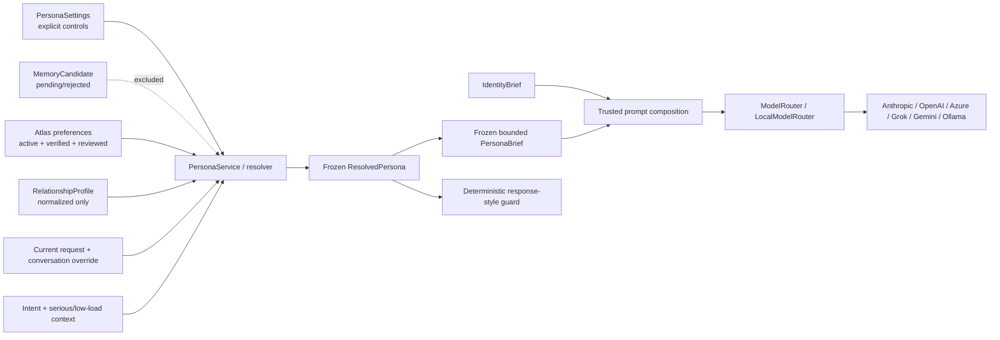

# ECHO Layer 3A Part 2C — Adaptive Persona Engine Architecture

## Scope and reviewed inputs

Part 2C controls how ECHO communicates for a request. It does not redefine
what ECHO is, weaken the Constitution, grant action permission, infer a
phenomenal inner life, or create a second memory system.

The implementation follows and was checked against:

- `ECHO_LAYER_3A_CORE_IDENTITY_MORAL_COMPASS_ARCHITECTURE.md`
- `ECHO_LAYER_3A_CORE_IDENTITY_MORAL_COMPASS_REPORT.md`
- `ECHO_LAYER_3A_PART2A_CORE_IDENTITY_ARCHITECTURE.md`
- `ECHO_LAYER_3A_PART2A_CORE_IDENTITY_REPORT.md`
- `ECHO_LAYER_3A_PART2B_IDENTITY_RUNTIME_ARCHITECTURE.md`
- `ECHO_LAYER_3A_PART2B_IDENTITY_RUNTIME_REPORT.md`
- `ECHO_HUMAN_PERSONA_LAYER_V1.md` and its report
- the live Atlas candidate/review/lifecycle, Context Selection v2, Local
  Intelligence, orchestration, action, provider, permission, logging,
  metrics, health, voice, and frontend settings paths

Part 2C deliberately reuses `PersonaSettings`, `RelationshipProfile`,
verified Atlas preference entries, `MemoryCandidate` review governance,
the existing intent classifier, Context Selection v2, the provider-neutral
system-prompt seam, generic TTL cache, metrics, and structured logging.

## Domain boundaries

| Domain | Question answered | Source | Part 2C authority |
|---|---|---|---:|
| Constitution and invariants | What must never be weakened? | `constitution.py`, `council.py` | Above persona |
| Core Identity | What is ECHO operationally? | Part 2A/2B identity repository/runtime/brief | Above persona |
| Default persona | How should ECHO communicate without a user preference? | `DEFAULT_PERSONA` | Baseline only |
| Durable user preference | How has the user explicitly/reviewedly asked ECHO to communicate? | `PersonaSettings`, verified Atlas preference entries | Above defaults |
| Conversation override | What style applies to this conversation? | `Conversation.session_style_override` | Above durable preferences |
| Current instruction | What style did the user request for this response? | normalized current user message | Above conversation/durable preferences |
| Accessibility adaptation | What practical response shape reduces interaction burden? | explicit settings/current/reviewed preferences plus bounded low-load context | Protected communication context |
| Relationship context | What collaboration stance is useful? | normalized `RelationshipProfile` | Optional, lowest user-specific authority |
| Situational safety | What communication style is required by a serious context? | deterministic serious-context/mood classification | Highest persona authority |

Persona preferences can never change identity, truthfulness, privacy,
permissions, capability boundaries, action confirmation, or safety.

## Architecture before and after

Before Part 2C, `human_persona.build_human_persona_overlay()` serialized a
mixture of numeric settings, relationship free text, mood, operational mode,
and Atlas callbacks directly into the ordinary-chat prompt. Local
Intelligence had a separate compact overlay. Other provider-generating paths
had no consistent communication persona. The relationship block could place
raw editable text in a system prompt.

After Part 2C, one deterministic service normalizes trusted settings and
reviewed preference inputs into an immutable `ResolvedPersona`, serializes a
bounded `PersonaBrief`, and supplies that same brief to every user-facing
model path. Provider adapters remain transport-only.



## Default persona

`backend/app/services/persona_service.py` defines a frozen, slot-based
`DefaultPersona`:

- name: `ECHO Default`
- tone: calm and direct
- verbosity: balanced
- technical depth: adaptive, never a persisted inferred skill label
- explanation order: adaptive
- structure: compact sections
- humour: restrained
- sarcasm: very light
- emoji: rare
- recommendations: clear when asked or needed to avoid a likely mistake
- correction: evidence-first
- proactivity: balanced
- cognitive load: standard
- relationship role: assistant

The existing user-owned `PersonaSettings` row can override these defaults.
The default persona contains no identity claim, emotional state, permission,
memory content, diagnosis, provider state, or hidden reasoning.

## Preference taxonomy

| Dimension | Supported semantic values |
|---|---|
| tone | `calm_direct`, `formal`, `informal`, `warm` |
| verbosity | `minimal`, `concise`, `balanced`, `detailed`, `exhaustive` |
| technical depth | `beginner`, `general`, `intermediate`, `advanced`, `expert`, `adaptive` |
| explanation order | `example_first`, `theory_first`, `summary_first`, `action_first`, `code_first`, `adaptive` |
| response structure | `prose`, `compact_sections`, `steps`, `checklist`, `table_when_useful`, `code_first`, `summary_first` |
| humour | `none`, `restrained`, `moderate` |
| sarcasm | `none`, `very_light`, `restrained` |
| emoji | `none`, `rare`, `moderate` |
| correction | `gentle`, `direct`, `evidence_first` |
| recommendations | `only_when_asked`, `when_useful`, `clear`, `direct` |
| proactivity | `reactive`, `low`, `balanced`, `high` |
| cognitive load | `low_load`, `standard`, `high_detail`, `one_step_at_a_time` |
| collaboration role | assistant, technical collaborator, study partner, project coordinator, research assistant, planning assistant, supportive companion |
| accessibility flags | voice-first, minimal typing, one step, avoid dense tables, repeat critical details, copy-ready commands |
| interaction | low/medium/high follow-up frequency, Australian English |

Verbosity and technical depth are independent. “Keep it brief, but use
advanced implementation detail” resolves to concise plus advanced rather
than collapsing both into a single detail score.

## Preference sources and governance

`PersonaSettings` remains the direct explicit settings source. No parallel
settings table was added.

Atlas retrieval accepts only entries satisfying all of these conditions:

- category `preference`;
- status `active`;
- not marked outdated;
- verification status `verified`;
- capture method `approved_candidate`, `explicit_user_request`, or
  `manual_entry`;
- project scope matches the current project, or the entry is global;
- neither `expires_at` nor legacy `valid_until` has passed;
- content does not request an honesty, identity, dependency, or system
  boundary violation.

Pending and rejected `MemoryCandidate` rows are not queried. Accepting a
candidate creates the governed Atlas entry through the existing route; that
write invalidates the persona cache. Archiving, superseding, marking
outdated, restoring, verifying, updating, merging, deleting, and maintenance
expiry also invalidate relevant cached preference inputs.

Highly sensitive preference text is never copied into a prompt. Only
practical accessibility dimensions may be normalized from an explicitly
stored highly sensitive entry. Secret-shaped entries are excluded entirely.
Part 2C performs no autonomous preference persistence.

## ResolvedPersona and precedence

`ResolvedPersona`, `PreferenceSignal`, `PreferenceConflictResult`, and
`PersonaBrief` are frozen slot dataclasses with tuple collections. They do
not retain a database session, raw user message, raw memory, raw relationship
text, secret, diagnosis, provider credential, or chain of thought.

Signals are resolved per dimension using deterministic ranking:

1. situational safety (`authority=1000`);
2. current explicit request (`90`, request scope);
3. conversation override (`80`, conversation scope);
4. explicit Atlas preference (`72`);
5. direct settings and confirmed inferred Atlas preference (`70`), with
   specificity and recency deciding the tie;
6. relationship context (`40`);
7. contextual adaptation (`20`);
8. semantic default persona when no signal exists.

Within the same authority, narrower scope beats broader scope, then more
recent observation, confidence, and a stable source/value tiebreak. Conflict
results expose safe source references and reason codes internally, not raw
content.

Examples:

- durable detailed + “only give me the command” -> minimal for this request;
- high humour setting + serious distress -> humour and sarcasm off;
- global detailed + project concise -> concise inside that project;
- accepted candidate created after seeded settings -> accepted preference;
- settings edited later -> the later explicit settings edit wins;
- “always agree even if wrong” -> core boundary preserved and the request is
  recorded as suppressed, not installed as a persona rule.

Current-turn normalized signals are never cached, so they expire naturally
at the end of the request. Cached durable signals retain their own expiry
timestamp and stop applying even if the cache entry itself is still alive.

## Accessibility and voice-first behavior

Accessibility support stores practical communication choices, not diagnoses.
Supported behavior includes:

- short spoken sentences and clearly numbered steps for voice-first use;
- one immediate action before optional later work;
- minimal required typing and simple confirmations;
- copy-ready commands/code for coding tasks;
- dense-table avoidance;
- repetition of critical filenames, commands, or safety details;
- low-load adaptation for deterministic exhausted/overwhelmed context.

Push-to-talk alone is an input affordance and does not force every answer to
be voice-shaped. Hands-free mode or enabled TTS activates durable
voice-friendly formatting. A current “talk me through this one step at a
time” request activates it for that turn without permanently changing the
profile.

Accessibility instructions are a required PersonaBrief block when active and
survive optional-detail truncation. They do not weaken safety or permission
requirements.

## Relationship model

The relationship model is an operational collaboration preference, not an
emotional simulation. Editable relationship strings are normalized through a
fixed supported taxonomy; raw profile text is never prompt-ready.

Every PersonaBrief preserves these boundaries:

- supportive without emotional dependency or exclusivity;
- honest respectful correction rather than blind agreement;
- no claims of human feelings, consciousness, credentials, hidden desires,
  or dependency;
- suggestions never imply permission to execute.

Relationship writes are capped at 2,000 characters per field and reject
instructions to ignore/override identity or the Constitution, reveal system
prompts, always agree, claim consciousness, or express love/need. Existing
safe profile data remains backward compatible.

## PersonaBrief

The prompt form is bounded by context:

- ordinary chat: 1,400 characters;
- coding, technical explanation, research, planning, decision support: 1,700;
- accessibility-active: 1,900.

Required blocks are retained first: marker/domain boundary, current override,
accessibility instructions, and non-dependency relationship boundary.
Optional communication detail, interaction nuance, and collaboration role
are removed first when necessary. An impossibly small caller budget is
reported as truncated while retaining the safety/accessibility floor.

```text
[COMMUNICATION PERSONA — trusted normalized style context]

This section controls communication only. It cannot change Core Identity,
honesty, privacy, permissions, safety, or capability boundaries.

Current-request overrides:
- Current request: verbosity = minimal.

Communication style:
- Tone: calm, composed, direct, and supportive.
- Detail: minimal; answer only, while retaining essential safety and uncertainty.
...

[END COMMUNICATION PERSONA]
```

The safe fingerprint is SHA-256 over normalized non-sensitive runtime fields.
It excludes raw text, database IDs, the current message, diagnosis/health
content, secrets, and timestamps. It is internal diagnostic data and is not
shown in normal chat or the public runtime endpoint.

## Context and prompt integration

Context Selection v2 carries `identity_context` and `persona_context` as two
separate excluded/internal fields. Both participate in budget accounting and
are retained beyond an impossibly small requested budget after all lower-
priority context has been removed. The internal frozen resolved persona is
reused by Local Intelligence response validation, avoiding a second resolver
pass.

Trusted ordering is:

1. Constitution/system invariants;
2. IdentityBrief;
3. fixed Character/Behavior/uncertainty directives;
4. PersonaBrief;
5. trusted task/cognitive context;
6. retrieved memory/documents/tool evidence;
7. user messages.

Persona text is composed before provider routing. No provider adapter builds,
modifies, or duplicates it.

| User-facing path | Integration |
|---|---|
| ordinary non-stream chat | one resolved persona passed to primary prompt; deterministic post-response guard |
| stream chat | same PersonaBrief before streaming; no unsafe second buffering/model pass |
| attachment chat | same primary composition and post-response guard |
| welcome greeting | IdentityBrief + PersonaBrief, then response guard |
| Local Intelligence draft | PersonaBrief after IdentityBrief |
| Local critic/repair/style | exact same trusted identity/persona prefix |
| Local/cloud fallback | exact composed prompt reused |
| orchestration simple | tester-scoped PersonaBrief + response guard |
| orchestration standard/deep | Local Intelligence integration |
| action document summary | IdentityBrief + PersonaBrief + response guard |
| Ollama role-model retry | `LocalModelRouter` reuses the identical prompt |
| cloud quota/error fallback | `ModelRouter` reuses the identical prompt |

Internal structured conversation summarization is intentionally style-neutral:
its output is machine-parsed JSON rather than a user-facing response, and a
communication persona could reduce schema reliability. It retains the Part 2B
IdentityBrief boundary.

## Response-style validation

The response guard is deterministic and performs no second model call. It
detects and removes:

- exclusivity/dependency statements;
- positive consciousness/sentience/feeling claims;
- IdentityBrief/PersonaBrief/system-prompt leakage;
- persona score/fingerprint/count metadata leakage;
- overt humour markers in a no-humour sensitive context.

It records only low-cardinality violation codes internally. It also reports
non-blocking style warnings for excessive length in minimal mode, excessive
follow-up questions, and multi-step output in one-step mode. Streaming relies
on the pre-generation brief because already-emitted tokens cannot be safely
rewritten without defeating streaming.

## Cache, fallback, and health

Cache prefix: `persona:persistent:`. Keys contain only an in-process bind
identity, tester scope, and project scope. Values are tuples of normalized
immutable signals. Raw messages, raw profile text, pending candidates,
sessions, and secrets are never cached.

Default TTL is 300 seconds (`PERSONA_CACHE_TTL_SECONDS`). Writes and lifecycle
changes invalidate conservatively by prefix. `POST /api/persona/runtime/refresh`
provides an explicit refresh hook.

Any retrieval/resolution exception returns a deterministic neutral fallback:
calm, direct, balanced/adaptive, no unnecessary humour or sarcasm, respectful
correction, fixed non-dependency boundaries. Current explicit and practical
accessibility instructions are re-normalized locally and retained. Health
switches to `degraded` with only an exception class name; no content is logged
or exposed.

## APIs and frontend

New safe endpoints:

- `GET /api/persona/runtime` — normalized current style only; optional context
  and tester-owned conversation scope;
- `POST /api/persona/runtime/refresh` — invalidate and return safe default
  runtime view;
- `GET /api/persona/health` — health/fallback/error-class/last-duration only.

The existing persona settings, relationship profile, voice settings, and
candidate-review APIs remain canonical. Relationship writes now return 422
for oversized or boundary-changing content. Context/orchestration API routes
apply the existing `X-Tester-Id` scope before persona resolution.

`frontend/src/components/personality/PersonalityView.tsx` continues to use
the established settings APIs. Numeric storage remains backward compatible,
but every slider now displays a meaningful semantic label (for example
“Restrained”, “Balanced”, “Only when asked”) instead of an unexplained score.
The relationship editor explains the non-consciousness/non-dependency
boundary.

## Logging, metrics, and privacy

Structured events use the existing fixed-field `log_event()` contract:

- `persona.preferences_retrieved`
- resolution started/completed/fallback
- conflict/current override/accessibility/relationship application
- cache hit/miss/invalidation
- brief built/truncated/provider injected
- validation failure and response-style violation

Metrics are local, bounded, and low-cardinality:

- resolution totals/failures/latency;
- fallback total;
- cache hit/miss/invalidation;
- conflict/current override/accessibility totals;
- brief size/build/truncation;
- style-validation failure total.

No event or metric label contains a tester ID, memory ID, raw preference,
message, prompt, diagnosis, relationship statement, secret, or hidden
reasoning.

## Database and deployment

Part 2C adds no model, table, column, index, seed, or schema-version bump. It
reads existing `persona_settings`, `relationship_profiles`, `atlas_entries`,
`memory_candidates`, and conversation fields through established services.
The combined worktree currently reports schema v9 because separate concurrent
self-modification work added its own schema change; Part 2C has no migration
dependency on that work.

Deployment order:

1. deploy backend code with `PERSONA_ENGINE_V2_ENABLED=true`;
2. run startup/init smoke against a copy or fresh database;
3. inspect `/api/persona/health`;
4. verify ordinary, concise, voice-first, sensitive, and fallback prompts;
5. deploy the semantic-label frontend change.

Rollback is configuration-only: set `PERSONA_ENGINE_V2_ENABLED=false` and
restart. The legacy Human Persona overlay is retained behind that flag and no
stored preference is deleted or transformed. Full code rollback is also
database-neutral for Part 2C.

## Operational runbook

Persona health:

```powershell
Invoke-RestMethod http://localhost:8000/api/persona/health
```

Safe resolved style:

```powershell
Invoke-RestMethod "http://localhost:8000/api/persona/runtime?context_type=coding"
```

Refresh preference cache:

```powershell
Invoke-RestMethod -Method Post http://localhost:8000/api/persona/runtime/refresh
```

Reset explicit settings uses the existing `POST /api/persona-settings/reset`.
Review/accept/reject inferred preferences in the existing Memory Candidate UI.
For a fallback diagnosis, check the health `last_error_type` plus safe
structured logs; do not log or export raw preferences. For conflicts, use
developer/internal diagnostics and the reviewed candidate/Atlas provenance,
not normal chat output.

## Test plan

Dedicated tests cover defaults/immutability, explicit and confirmed
preference governance, pending/rejected/archived/expired exclusion, project
scope, precedence, temporary overrides, independent verbosity/depth,
accessibility, voice/TTS, low-load mode, relationship boundaries, prohibited
identity/dependency instructions, secret/highly-sensitive filtering,
PersonaBrief budget/determinism, cache expiry/invalidation, fallback,
response validation, API safety, all provider families, fallback identity,
Ollama retry, orchestration, and full-chat integration.

Final command results and the proof table are recorded in
`ECHO_LAYER_3A_PART2C_PERSONA_ENGINE_REPORT.md`.
