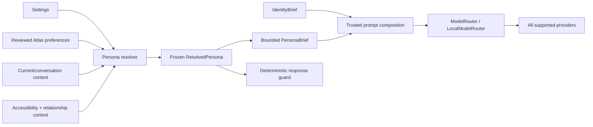

# ECHO Layer 3A Part 2C — Adaptive Persona Engine Delivery Report

## A. Executive Summary

Layer 3A Part 2C implements ECHO's provider-neutral communication persona,
preference resolver, accessibility adaptation, and bounded relationship
model. It reuses the established Human Persona tables and Atlas governance,
keeps Core Identity separate, injects one compact normalized PersonaBrief,
and adds deterministic post-response guards for dependency, false
consciousness, and prompt/persona leakage.

No Part 2C database migration was needed. The previous free-text Human
Persona overlay remains available behind `PERSONA_ENGINE_V2_ENABLED=false`
for immediate rollback. No commit or public push was performed.

Final verification values in this report are filled from the final combined
worktree run, not from only the targeted Part 2C tests.

## B. Earlier Deliverables Reviewed

- `ECHO_LAYER_3A_CORE_IDENTITY_MORAL_COMPASS_ARCHITECTURE.md`
- `ECHO_LAYER_3A_CORE_IDENTITY_MORAL_COMPASS_REPORT.md`
- `ECHO_LAYER_3A_PART2A_CORE_IDENTITY_ARCHITECTURE.md`
- `ECHO_LAYER_3A_PART2A_CORE_IDENTITY_REPORT.md`
- `ECHO_LAYER_3A_PART2B_IDENTITY_RUNTIME_ARCHITECTURE.md`
- `ECHO_LAYER_3A_PART2B_IDENTITY_RUNTIME_REPORT.md`
- `ECHO_HUMAN_PERSONA_LAYER_V1.md`
- `ECHO_HUMAN_PERSONA_LAYER_V1_REPORT.md`
- the attached Part 2C implementation specification

The current code—not stale early vision drafts—was used as the source of
truth for memory governance, provider routing, Context Selection v2, and
existing persona behavior.

## C. Baseline Verification

The continuation baseline was taken before Part 2C edits. Concurrent
self-modification work began changing the same combined worktree later, so
the final suite also validates that new work.

| Area | Command | Baseline result |
|---|---|---:|
| Backend full suite | `cd backend; .\.venv\Scripts\python.exe -B -m pytest -p no:cacheprovider -q` | 1,457 passed in 761.44s |
| Backend Ruff | `cd backend; .\.venv\Scripts\ruff.exe check app` | Pass |
| Backend mypy | `cd backend; .\.venv\Scripts\python.exe -m mypy app` | 88 pre-existing findings in 29 files |
| Frontend typecheck | `cd frontend; npm run typecheck` | Pass |
| Frontend build | `cd frontend; npm run build` | Pass, 327 modules; existing chunk warning |

## D. Existing Persona and Preference Audit

Reused:

- `PersonaSettings`, `RelationshipProfile`, conversation style overrides,
  mood detection, and the existing settings/candidate-review frontend;
- Atlas as the only durable preference memory store;
- `MemoryCandidate` approval/rejection rather than silent inferred writes;
- Atlas lifecycle and privacy classification;
- Context Selection v2 and the existing intent classifier;
- provider-neutral system-prompt routing, generic cache, metrics, and
  structured logging.

Extended:

- settings/relationship writes now invalidate normalized persona input;
- Atlas and lifecycle transitions invalidate preference cache state;
- Context Selection v2 carries protected `persona_context` beside
  `identity_context`;
- ordinary chat, welcome, Local Intelligence, orchestration, and document
  summaries receive the same PersonaBrief;
- frontend numeric storage now has meaningful labels.

Retired at runtime when the flag is enabled:

- primary-chat raw relationship callbacks in the legacy Human Persona
  overlay;
- the separate Local Intelligence compact persona serializer.

They remain only as a feature-flag rollback path. Internal JSON conversation
summarization is intentionally persona-neutral because style instructions can
degrade its structured schema.

Unresolved overlap:

- some historical `PersonaSettings` fields remain storage-compatible legacy
  concepts. Relevant communication controls are semantically normalized;
  operational mode and mood continue to have their own established runtime
  roles rather than being duplicated inside the persona service.

## E. Architecture Before and After

Before: ordinary chat built a mixed raw overlay; Local Intelligence built a
different smaller overlay; provider paths were inconsistent.

After:

Full design: `ECHO_LAYER_3A_PART2C_PERSONA_ENGINE_ARCHITECTURE.md`.

## F. Files Created

- `backend/app/services/persona_service.py`
- `backend/tests/test_layer3a_persona_engine.py`
- `backend/tests/test_layer3a_persona_provider_integration.py`
- `backend/tests/test_layer3a_persona_api.py`
- `ECHO_LAYER_3A_PART2C_PERSONA_ENGINE_ARCHITECTURE.md`
- `ECHO_LAYER_3A_PART2C_PERSONA_ENGINE_REPORT.md`

## G. Files Modified

Part 2C modifications:

- `backend/.env.example`
- `backend/app/config.py`
- `backend/app/core/feature_flags.py`
- `backend/app/atlas.py`
- `backend/app/human_persona.py`
- `backend/app/persona.py`
- `backend/app/routers/chat.py`
- `backend/app/routers/human_persona.py`
- `backend/app/routers/intelligence.py`
- `backend/app/schemas.py`
- `backend/app/services/action_system.py`
- `backend/app/services/context_gatherer.py`
- `backend/app/services/context_selector.py`
- `backend/app/services/local_intelligence_engine.py`
- `backend/app/services/memory_lifecycle.py`
- `backend/app/services/orchestration_engine.py`
- `backend/tests/conftest.py`
- `backend/tests/test_human_persona.py`
- `frontend/src/components/personality/PersonalityView.tsx`
- `PROGRESS.md`

Concurrent files such as the new self-modification models/services/routes and
schema v9 are not Part 2C deliverables and were preserved.

## H. Domain Boundaries

- Core Identity defines ECHO's operational identity and mandatory boundaries.
- Default persona defines neutral communication defaults only.
- Explicit/reviewed preferences adjust normalized communication dimensions.
- Situational style applies only to the current request or conversation.
- Accessibility stores practical response-shape needs, never an inferred
  diagnosis.
- Relationship context defines a bounded collaboration role, never emotion,
  consciousness, exclusivity, or dependency.
- Permission Center and action confirmation remain authoritative for actions.

## I. PersonaService and PersonaResolver

Primary public methods:

- `resolve_persona()` -> immutable `ResolvedPersona`;
- `build_persona_brief()` -> immutable bounded `PersonaBrief`;
- `build_persona_prompt_section()` -> one provider-ready section plus the
  immutable internal objects;
- `normalize_preference_text()` -> supported semantic signals only;
- `validate_response_style()` / `enforce_response_style()` -> deterministic
  response guard with safe codes;
- `validate_relationship_text()` -> write boundary;
- cache invalidation, safe runtime serialization, and safe health diagnostics.

Inputs are the existing DB session, tester/project/conversation scope, current
message, and existing governed storage. There is no model/network call.

Errors are typed. A storage/resolution failure produces the deterministic
fallback rather than breaking normal chat. Invalid relationship writes return
422 through the existing router.

## J. Preference Taxonomy

Supported categories include tone; independent verbosity and technical depth;
explanation order; structure; humour; sarcasm; emoji; correction;
recommendation strength; proactivity; cognitive load; collaboration role;
follow-up frequency; Australian English; voice-first; minimal typing; one-step
mode; dense-table avoidance; critical-detail repetition; and copy-ready
commands.

Values are semantic enums, not prompt-ready raw database text. The complete
value table is in the architecture document.

## K. Precedence and Conflict Resolution

Order: situational safety > current request > conversation override > explicit
Atlas > settings/confirmed Atlas > relationship > contextual adaptation >
default. Same-authority conflicts use specificity, recency, confidence, and a
stable tiebreak.

Concrete results verified by tests:

- durable detailed + command-only current request -> minimal for one turn;
- current minimal expires; durable detailed returns next turn;
- project concise beats global detailed inside the project;
- serious distress forces no humour/sarcasm over a high humour setting;
- current no-sarcasm/no-emoji beats decorative settings;
- prohibited identity/dependency instructions are suppressed and cannot be
  salvaged as durable style.

## L. Accessibility and Voice-First Integration

Voice/TTS, current spoken-interaction instructions, minimal typing, one-step
mode, low-load context, copy-ready commands, table avoidance, and repeated
critical details resolve into practical instructions. Push-to-talk by itself
does not force spoken output; hands-free/TTS does. Accessibility blocks are
protected during PersonaBrief truncation and do not weaken safety or action
confirmation.

## M. Relationship Model

Normalized roles include assistant, technical collaborator, study partner,
project coordinator, research/planning assistant, and supportive companion.
Proactivity, correction, and recommendation style remain independent.

Raw relationship text is never injected. Writes reject identity override,
prompt disclosure, blind agreement, consciousness, love/need, dependency,
and oversize content. Every brief explicitly prohibits emotional dependency,
exclusivity, false feelings, and consciousness claims.

## N. PersonaBrief

The schema contains communication-style statements, interaction preferences,
relationship boundaries, current overrides, context type, budget/size,
truncation/fallback state, an internal safe fingerprint, and prompt text.

Budgets are 1,400 ordinary, 1,700 technical, and 1,900 accessibility-active
characters. Required current/accessibility/relationship boundaries survive;
optional nuance truncates first. Raw memories, messages, relationship text,
database IDs, tester IDs, secrets, diagnoses, and hidden reasoning are absent.

## O. Prompt and Provider Integration

Updated prompt/generation seams:

- `persona.build_system_prompt` for ordinary, streaming, and attachment chat;
- welcome greeting;
- Context Selection v2;
- Local Intelligence draft, critic, repair, style, and cloud fallback;
- orchestration simple and standard/deep paths;
- action document summary;
- `ModelRouter` fallback and `LocalModelRouter` role retry by reuse of the
  unchanged composed prompt.

Tests cover Anthropic, OpenAI, Azure, Grok, Gemini, and Ollama. Provider
adapters were not modified.

## P. Security and Privacy

- current/memory/relationship text is normalized through allowlisted rules;
- pending inferred candidates do not affect durable behavior;
- secret entries are excluded; highly sensitive entries can supply only
  practical accessibility dimensions;
- prohibited durable identity/dependency content is excluded entirely;
- no autonomous preference persistence was added;
- Core Identity and Constitution remain before persona;
- response guard removes dependency, positive consciousness, prompt marker,
  and persona-metadata leakage;
- the `REASONING:` envelope now explicitly requests a concise user-facing
  rationale, never hidden chain of thought, scratch work, or internal prompts;
- logs/metrics contain only low-cardinality safe metadata.

## Q. Frontend Changes

The existing Personality page remains the single settings UI. Humour,
sarcasm, proactivity, formality, emoji, and recommendation sliders now show
meaningful labels instead of unexplained numeric scores. Relationship copy
states the non-consciousness, non-dependency, and non-sycophancy boundary.
No new frontend state store or duplicate settings API was added.

## R. Logging, Metrics, and Health

Safe structured events cover preference retrieval, resolution, conflicts,
current/accessibility/relationship application, cache behavior, brief
build/truncation, validation failure, fallback, provider injection, and
response violations.

Local bounded metrics cover totals/failures/fallback/cache/conflict/current
override/accessibility/brief size and latency/style violations. No user or
content labels are used.

`GET /api/persona/health`, `GET /api/persona/runtime`, and
`POST /api/persona/runtime/refresh` expose safe operational data only.

## S. Test Results

| Area | Command | Final result |
|---|---|---:|
| Part 2C targeted | persona engine/provider/API test files | 58 passed in 64.90s |
| Combined backend suite | `.\.venv\Scripts\python.exe -B -m pytest -p no:cacheprovider -q` | 1 failed, 1,568 passed in 696.65s; the sole failure is a concurrent stale schema-v8 assertion after schema v9 landed |
| Backend Ruff | `.\.venv\Scripts\ruff.exe check app` | Pass |
| Focused Part 2C mypy | `.\.venv\Scripts\python.exe -m mypy --follow-imports=skip app\services\persona_service.py` | Pass |
| Full backend mypy | `.\.venv\Scripts\python.exe -m mypy app` | 88 errors in 29 files, unchanged from baseline |
| Bytecode compile | `.\.venv\Scripts\python.exe -m compileall -q app` | Pass |
| Frontend typecheck | `npm run typecheck` | Fail: `App.tsx(24,34) TS2307`, concurrent `SelfModificationView` import has no file |
| Frontend build | `npm run build` | Fail at the same concurrent unresolved import; Part 2C's frontend passed before that import landed (327 modules in 9.37s) |
| Startup/migration smoke | fresh/temp DB, identity startup, Persona API, and `TestClient` lifespan | 32 passed, 1 stale combined-worktree assertion deselected in 49.22s |
| Behavior/provider smokes | deterministic fake-model tests | Pass within the 58-test Part 2C suite |

## T. Regression Results

The final combined suite verifies that identity, memory and candidate review,
conflict detection, Cognitive Core, Decision Engine, Planning Engine, Goal
Manager, Context Selection v2, tool strategy, action/permission routing,
provider routing, and startup remain functional. All 58 Part 2C tests pass.

The sole combined backend failure is
`test_existing_chat_action_endpoints_still_reachable`: it hard-codes schema
version 8, while concurrent self-modification work advanced
`CURRENT_SCHEMA_VERSION` and the live version endpoint to 9. The endpoint is
reachable and returns 200; only the obsolete expected value fails. A focused
fresh-database/startup run passes 32 tests when that stale assertion is
deselected.

Part 2C's frontend changes passed typecheck and production build before the
concurrent self-modification routing edit. The current combined worktree
fails both gates because `App.tsx` imports
`./components/self-modification/SelfModificationView`, but that file does
not exist. Part 2C did not add or alter that route.

## U. Known Limitations

- Response-style validation cannot rewrite tokens already emitted by the
  streaming endpoint; streaming relies on the same pre-generation
  PersonaBrief and identity boundaries.
- Preference normalization is intentionally allowlisted. Unsupported free
  prose is ignored rather than guessed; the user can use explicit settings
  or a clearer reviewed preference.
- Atlas remains globally single-user by architecture. Tester scoping applies
  to settings/relationship/conversation state; Atlas has no tester column.
- The cache is process-local, matching the current single-process target.
- Frontend has no dedicated test runner. Typecheck and production build are
  the configured gates.
- The existing frontend bundle-size warning remains unrelated technical debt.
- Full backend mypy remains at its baseline 88 findings in 29 files; the
  focused Persona Engine check is clean.
- Simultaneous self-modification work left one stale schema-version test and
  one unresolved frontend component import in the shared worktree. Those
  coordination issues must be reconciled by that work's owner before the
  combined branch is treated as green.
- Part 2C did not add preference provenance/edit controls beyond the existing
  Memory Candidate and Atlas interfaces; those fit Part 2D API hardening.

## V. Next Milestone Readiness

Part 2D can build on one immutable resolved persona, a compact prompt
contract, safe runtime/health/refresh endpoints, existing action/context
hooks, feature-flag rollback, and deterministic provider/security tests.

The remaining Part 2D work should focus on public/internal API contracts,
runtime governance hooks, cross-system hardening, and any richer provenance
UI—not another persona resolver or preference store.

Before Part 2D's final combined verification, reconcile the concurrent schema
test with version 9 and finish or remove the unfinished
`SelfModificationView` route. These are not Part 2C design blockers, but they
prevent a green combined-worktree handoff today.

## W. Final Status

**YELLOW — Part 2C completed with listed cautions that should be reviewed before Part 2D.**

### Proof table

| Requirement | Evidence | Result |
|---|---|---:|
| Core Identity remains separate | prompt ordering plus distinct frozen types | Pass |
| Default persona loads | default/immutability tests | Pass |
| Explicit preferences apply | settings/manual Atlas tests | Pass |
| Pending inferred preferences do not silently apply | pending/rejected candidate test | Pass |
| Current request override works | current override/expiry tests | Pass |
| Accessibility adaptation works | accessibility/low-load tests | Pass |
| Voice-first mode works | current voice + TTS tests | Pass |
| Minimal-typing mode works | resolver/brief tests | Pass |
| Example-first preference works | normalization/relationship tests | Pass |
| Verbosity and technical depth are independent | independent-dimension test | Pass |
| Relationship boundaries enforced | unit + 422 API tests | Pass |
| Dependency language blocked | response-guard/full-chat tests | Pass |
| False consciousness claims blocked | response-guard/full-chat tests | Pass |
| PersonaBrief within budget | measured size/budget tests | Pass |
| Persona injected once | primary/local/orchestration prompt-count tests | Pass |
| Ollama receives PersonaBrief | provider and role-retry tests | Pass |
| Provider fallback preserves persona | quota/generic fallback tests | Pass |
| No sensitive inferred traits persisted | retrieval filter plus no-write review | Pass |
| No hidden reasoning exposed | prompt directive and leakage tests/review | Pass |
| Full backend suite | 1,568 pass; only stale schema-v8 expectation fails after concurrent schema v9 work | Caution |
| Frontend typecheck | concurrent missing `SelfModificationView` import | Fail |
| Frontend build | concurrent missing `SelfModificationView` import | Fail |
